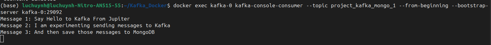
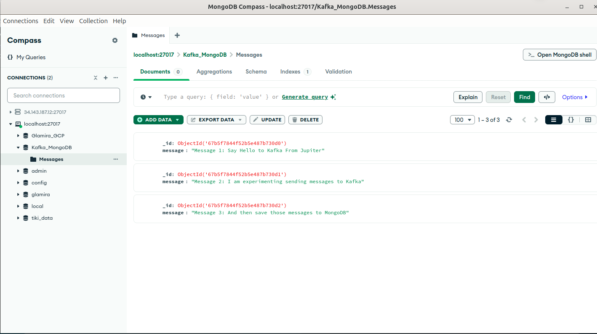

# Kafka to MongoDB Integration

## Overview
This project demonstrates how to integrate Kafka with MongoDB using a Python script. The script reads predefined messages, produces them to a Kafka topic, and then consumes them from Kafka before storing them in MongoDB.

## Project Workflow
1. **Create Kafka Topic**: A topic is created with 3 partitions and a replication factor of 3.
2. **Produce Messages to Kafka**: The script `kafka_mongo_integration.ipynb` sends predefined messages to the Kafka topic.
3. **Consume Messages from Kafka**: The script reads messages from Kafka and stores them in MongoDB.

## Prerequisites
Before running the project, ensure you have:
- **Docker** (for Kafka setup)
- **Kafka** (running inside Docker)
- **MongoDB** (either local or containerized)
- **Python 3** with required dependencies: 
  - `pymongo`
  - `confluent_kafka`

## Setup Instructions
### 1. Start Kafka and Create Topic
Run the following command to create the Kafka topic:
```sh
docker exec kafka-0 kafka-topics --create --topic project_kafka_mongo --bootstrap-server kafka-0:29092 --partitions 3 --replication-factor 3
```

### 2. Run the Kafka-MongoDB Integration Script
Execute the Jupyter notebook `kafka_mongo_integration.ipynb`, which will:
- Send messages to Kafka
- Read messages from Kafka
- Store messages in MongoDB

### 3. Verify Data in Kafka
Consume messages from the topic to check if they were produced successfully:
```sh
docker exec kafka-0 kafka-console-consumer --topic project_kafka_mongo_1 --from-beginning --bootstrap-server kafka-0:29092
```

### 4. Verify Data in MongoDB
Use **MongoDB Compass** or run the following query in MongoDB shell:
```sh
db.Messages.find().pretty()
```

## Example Output
### Kafka Console Consumer Output
```sh
Message 1: Say Hello to Kafka From Jupiter
Message 2: I am experimenting sending messages to Kafka
Message 3: And then save those messages to MongoDB
```

### MongoDB Stored Data
```json
{
  "_id": ObjectId("67b5f7844f52b5e487b730d0"),
  "message": "Message 1: Say Hello to Kafka From Jupiter"
}
{
  "_id": ObjectId("67b5f7844f52b5e487b730d1"),
  "message": "Message 2: I am experimenting sending messages to Kafka"
}
{
  "_id": ObjectId("67b5f7844f52b5e487b730d2"),
  "message": "Message 3: And then save those messages to MongoDB"
}
```

## Project Directory Structure
```
Kafka_Docker/
│-- docker-compose.yml
│-- kafka_mongo_integration.ipynb
│-- config/
│   │-- kafka/
│   │   ├── kafka_server_jaas.conf
```

## Screenshots
### Kafka Console Consumer Output


### MongoDB Compass Output


## Technologies Used
- **Kafka** (for messaging system)
- **MongoDB** (for data storage)
- **Python** (for scripting)
- **Docker** (for containerized Kafka setup)

## License
This project is open-source and available for modification.

## Author
Luc Huynh

